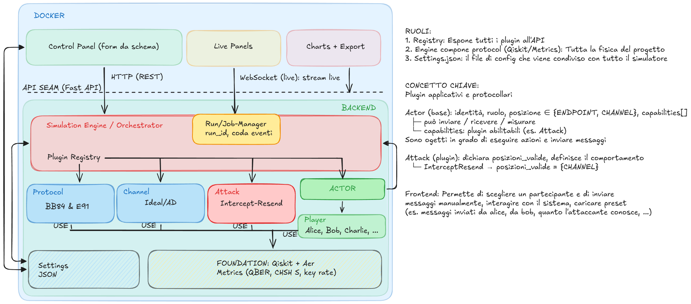

# Quantum Crypto Simulator

<details open><summary>EN</summary>

Simulator of the **BB84** and **E91** quantum key distribution protocols, written in Python with
Qiskit.

> **Status: work in progress.** The repository currently contains only the scaffolding. The
> sections below describe the goal, nothing more. This README will be rewritten with the actual
> results once there are any.

## Assignment

_Simulate the BB84 and E91 protocols. For both, simulate an **intercept-resend** attack and verify
the QBER it produces. Introduce noise by simulating an **amplitude damping** channel (optical fiber
losses) and measure the QBER in that case as well._

## Project approach

The quality of this simulation hinges on how the noise is modelled.

The naive approach is to flip the bit with a given probability, that is, a classical bit-flip
applied to the bits after measurement. That choice would make the implementation simpler, but it
would introduce a coarse error: it would not be simulating a quantum channel at all, it never
touches coherence, and it is symmetric.
In this implementation the noise is a genuine CPTP channel applied to the qubit in transit,
described by its Kraus operators and simulated in `density_matrix` mode.

Amplitude damping models the loss of energy towards the ground state ($|1\rangle$ decays to
$|0\rangle$ with probability $\gamma$, while $|0\rangle$ stays put), which is what physically
happens in the fiber. Being asymmetric, it produces a QBER that depends on the measurement basis,
an effect that neither a classical bit-flip nor a depolarizing channel, both symmetric, can
reproduce.
This is the phenomenon the simulator has to make visible.

The parameter $\gamma$ is tied to the fiber length by $\gamma = 1 - e^{(\frac{-L}{L_0})}$, so the
curves can be read in kilometres and not only in abstract units.

## Architecture



Protocol, channel, attack and actor are four **independent** axes, not an inheritance hierarchy:
any protocol can run over any channel, with or without an attacker. A plugin registry composes
them from a configuration, avoiding the proliferation of classes such as `BB84WithDampingAndEve`.

Actors have a position (`ENDPOINT` or `CHANNEL`) and every attack declares the positions where it
is allowed. Intercept-resend, for instance, is defined only on the channel. Making this constraint
explicit and checkable serves to describe the threat model in the code instead of leaving it
implicit.

On top of the simulation engine sit an HTTP backend and a web frontend that allow a run to be
configured, followed in real time and exported as plots.

## Stack

- Python 3.12, Qiskit 2.3.1 with qiskit-aer (primitives V2)
- FastAPI and pydantic for the API and configuration validation
- React, Vite, TypeScript, Plotly.js for the interface
- Docker Compose to bring everything up

## Planned structure

```
src/qkd/        simulation core (protocols, channels, attacks, ...)
tests/          tests on the acceptance cases (expected QBER, value of S)
notebooks/      analysis and plots for the report
figures/        exported figures
report/         report
```

## References

The reference material consists of the course notes and my bachelor's thesis *Crittografia
Quantistica e Cyber Security*, from which this project takes the subject but not the
implementation: that one was in QuTiP and treated the channel classically. For quantum channels
and Kraus operators, Nielsen & Chuang, *Quantum Computation and Quantum Information*, ch. 8.

## License

Code released under **CC BY-NC-SA 4.0**. Non-commercial use, attribution required, derivative
works under the same license.

## Author

Giovanni Lorenzo Murfuni

</details>

<details><summary>IT</summary>

Simulatore dei protocolli di distribuzione quantistica di chiave **BB84** ed **E91**, scritto in
Python con Qiskit.

> **Stato: in sviluppo.** Al momento il repository contiene solo l'impalcatura. Le sezioni qui
> sotto descrivono l'obiettivo, nulla di più. Questo README verrà riscritto con i
> risultati veri quando ci saranno.

## Traccia

_Simulare i protocolli BB84 ed E91. Per entrambi, simulare un attacco **intercept-resend** e verificare il QBER che produce. Introdurre rumore simulando un canale di **amplitude damping** (perdite nelle fibre ottiche) e misurare il QBER anche in quel caso._

## Impostazione del progetto

Il punto su cui si gioca la qualità di questa simulazione sta nel modo in cui viene modellato il rumore.

L'approccio ingenuo consiste nell'invertire il bit con
una certa probabilità, cioè un bit-flip classico applicato ai bit dopo la misura. Questa scelta incrementerebbe la semplicità di implementazione, ma introdurrebbe un errore grossolano; infatti, non starei simulando un canale quantistico, non tocca la coerenza, ed è simmetrico.
In questa implementazione il rumore è un vero canale CPTP applicato al qubit in transito, descritto dai suoi operatori di Kraus e simulato in modalità `density_matrix`.

L'amplitude damping modella la perdita di energia verso lo stato
fondamentale ($|1\rangle$ decade verso $|0\rangle$ con probabilità $\gamma$, mentre $|0\rangle$ resta), che è quello che succede
fisicamente nella fibra. Essendo asimmetrico produce un QBER che dipende dalla base di misura, un effetto che un bit-flip classico o un canale depolarizzante, entrambi simmetrici, non possono
riprodurre.
Questo è il fenomeno che il simulatore deve rendere visibile.

Il parametro $\gamma$ è legato alla lunghezza della fibra da $\gamma = 1 - e^{(\frac{-L}{L_0})}$, così le curve si possono
leggere in chilometri e non solo in unità astratte.

## Architettura


Protocollo, canale, attacco e attore sono quattro assi **indipendenti**, non una gerarchia di
ereditarietà: qualunque protocollo può girare su qualunque canale, con o senza attaccante. Un
registry di plugin li compone a partire da una configurazione, evitando la moltiplicazione di
classi tipo `BB84ConDampingEdEve`.

Gli attori hanno una posizione (`ENDPOINT` o `CHANNEL`) e ogni attacco dichiara le posizioni in
cui è ammesso. L'intercept-resend, per esempio, è definito solo sul canale. Rendere questo vincolo esplicito e
verificabile serve a descrivere il modello di minaccia nel codice invece di lasciarlo implicito.

Sopra al motore di simulazione ci sono un backend HTTP e un frontend web che permettono di
configurare una run, seguirne l'andamento in tempo reale ed esportare i grafici.

## Stack

- Python 3.12, Qiskit 2.3.1 con qiskit-aer (primitives V2)
- FastAPI e pydantic per l'API e la validazione della configurazione
- React, Vite, TypeScript, Plotly.js per l'interfaccia
- Docker Compose per l'avvio dell'insieme

## Struttura prevista

```
src/qkd/        nucleo della simulazione (protocolli, canali, attacchi, ...)
tests/          test sui casi di accettazione (QBER atteso, valore di S)
notebooks/      analisi e grafici per la relazione
figures/        figure esportate
report/         relazione
```

## Riferimenti

Il materiale teorico di riferimento sono le dispense del corso e la mia tesi triennale
*Crittografia Quantistica e Cyber Security*, da cui questo progetto riprende l'argomento ma non
l'implementazione: quella era in QuTiP e trattava il canale in modo classico. Per i canali
quantistici e gli operatori di Kraus, Nielsen & Chuang, *Quantum Computation and Quantum
Information*, cap. 8.

## Licenza

Codice rilasciato sotto **CC BY-NC-SA 4.0**. Uso non commerciale, attribuzione richiesta,
opere derivate sotto la stessa licenza.

## Autore

Giovanni Lorenzo Murfuni

</details>
