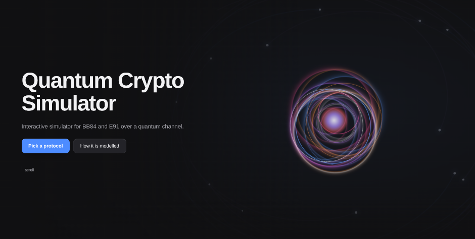
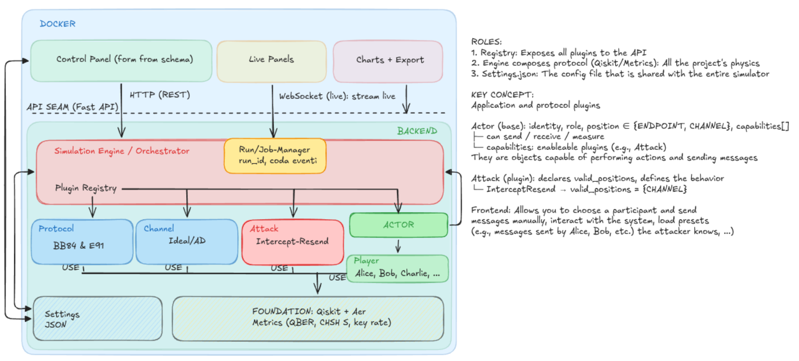

# Quantum Crypto Simulator


<details open><summary>EN</summary>

## Summary

Simulator of the **BB84** and **E91** QKD protocols, written in Python with the Qiskit library.
The engine models the channel as a genuine completely positive trace-preserving map (CPTP) rather
than a classical bit-flip, runs each protocol over any combination of channel and attacker, and
exposes everything through a web interface that lets simulations be configured, followed live and
their results exported.

## Implementation

Implementation was carried out at the same time as the study of the concepts behind the project.
The bachelor's thesis had already tackled a simulation of the two protocols, but built with the
QuTiP library and over a channel modelled with bit-flipping variations. For Quantum Crypto
Simulator the whole codebase was rewritten, in order to obtain a more mature product than the
previous work and to represent realistically the physical events that occur during the various
phases of the protocol.

The work was developed in two phases. Each phase was split into blocks containing their
sub-tasks: a block is considered closed only when its automated test suite finishes with 100%
passing results.

### Development phases and workflow

The backend is written in Python and adopts a plugin architecture, described in Section 7 [of the
report]. The `src` folder contains all the files needed for the engine to work:

```
src/
  qkd/
    actors
    api
    appconfig
    attacks
    bb84
    channels
    e91
    engine
    metrics
    registry
    settings
    types
```

The modules are:

- **types**: collects the type aliases used in the code.
- **actors**: characterises the actor and identifies it as a legitimate player or an attacker.
  This module is fundamental to the engine because it defines the actions the actor can perform,
  making it possible to check whether it has the permissions to carry out the requested action:
  the object holds a list of capabilities (e.g. intercept-resend) and a `can_perform()` method
  that checks whether the action falls within the capabilities and whether the actor's position
  allows it to be carried out.
- **settings**: manages all the simulation configurations (protocol used, channel type, attack,
  etc.).
- **appconfig**: keeps track of the functional configurations related exclusively to the API.
- **metrics**: protocol metrics (QBER, correlators, CHSH).
- **bb84**: the protocol.
- **e91**: the protocol.
- **channels**: represents the channels — ideal, and optical fibre with amplitude damping.
- **attacks**: implementation of the intercept-resend attack (extensible if needed).

The other modules are covered in more depth in the report
**[Quantum Crypto Simulator — Progettazione (PDF)](report/Quantum%20Crypto%20Simulator%20Progettazione.pdf)**.



During the various development phases the use of AI tools was integrated, specifically: a Coding
Agent and a testing Skill.

Erwin is a tutoring skill: it recognises whether the task carried out rests on theoretical
foundations. On the various implementation blocks it cannot provide solutions or implement code,
but limits itself to asking why that specific implementation was chosen, what the alternatives
are and their relative advantages and disadvantages. Should it notice gaps or logical errors in
the code, it points to a precise theoretical reference. At the start of every session it
autonomously reconstructs the state of progress by reading the repository and the git history,
compares it with the work plan and the milestone calendar, and explicitly flags any delays on
the critical path. During review it applies a checklist of modelling traps: noise represented as
a classical bit-flip rather than as a quantum channel, Kraus operators that are not
trace-preserving, simulation not in density matrix, wrong signs in the CHSH correlators, damping
applied symmetrically; it checks that the seeds and the sample sizes of the tests are fixed and
statistically justifiable. In addition, the skill is responsible for reading the code and the
theoretical material and implementing automated tests (pytest) that are run to verify the correct
behaviour of the individual modules. Every question asked by Erwin and every answer given by the
user flow into a structured log organised by concept.

The implementation strategy followed is this:

| Activity | Development | Review |
|---|---|---|
| System modelling | Human | Erwin |
| High-level design | Human | Erwin |
| Backend implementation | Human | Erwin |
| Functional tests | Erwin | Human |
| In-code documentation (comments) | Erwin | Human |
| Frontend layout | Human | Claude Design |
| Frontend implementation | Claude Code | Human |
| Code review | Claude Code | Human |

The use of AI tools has the purpose of: assisting task management and scheduling, keeping track
of the state of progress of the work, minimising logical errors in the implementation, reducing
the effect of the developer's bias by introducing an objective reviewer, and reducing the
implementation time for non-formative blocks (e.g. writing frontend code, multi-language support,
themes, etc.).

## Architecture: Plugin

Protocol, channel, attack and actor are four independent axes; a plugin registry composes them
from a configuration, avoiding the proliferation of classes. Every attack declares the set of
positions where it is allowed, every actor carries its own position and capabilities, and a
single function joins the two halves and refuses the combination when the actor's position is not
among the valid ones.

## Quick Start

### Clone

```
git clone https://github.com/G-ho5t-Wr1t3r/Quantum_Crypto_Simulator.git
cd Quantum_Crypto_Simulator
```

### Run with Docker

```
docker compose up -d --build
```

The simulator will be available at <http://localhost:8000>. The first build takes a few minutes
(qiskit-aer is a large install) and the API container has a 40 s start grace period before the
web container waits on its health check.

### Run with Podman

The same `docker-compose.yml` works unchanged.

```
podman compose up -d --build
```

On an SELinux host (Fedora, RHEL, etc.), a rootless Podman needs the mounted `config.json`
relabelled for the container; the compose file already carries the `:Z` flag. The published port
is `8000` by default; to change it:

```
QKD_PORT=9000 podman compose up -d --build
```

### Headless use

The simulator is meant to be used as a local web app. Installing the engine dependencies alone,
without the containers, makes sense from a development standpoint: to add a command-line interface
later, or to extend the code and run its tests. It is enough to create a virtual environment and
install the dependencies:

```
python3 -m venv .qkd_venv && source .qkd_venv/bin/activate
pip install -r requirements.txt
```

Tests run with `pytest`.

### Configuration

`config.json` holds the service limits (max concurrent runs, run history, synchronous-run qubit
ceiling) and the contact links printed in the footer. Being bind-mounted, the Settings panel in
the interface writes to it and the change outlives the container. Recreate the API service
(`docker compose up -d --force-recreate api`) after an out-of-band edit, or just use the Settings
panel.

The interface talks to the backend under an `/api` prefix that the reverse proxy strips. Behind
the compose stack the auto-generated, always-accurate API reference is at
<http://localhost:8000/api/docs> (Swagger UI) and <http://localhost:8000/api/openapi.json>.

## How it works

The engine composes one protocol with one channel and one attacker from a JSON configuration,
runs the trial in a worker thread, and streams the events as they happen. There are four main
functions, each on its own screen: a run represents what happens at one point, a sweep shows the
repercussions as a quantity varies, a comparison shows what happens on an ideal channel with an
attacker and what happens on the real channel with no threats, and the envelope maps the region
where the protocol can operate.

### Run Configuration

<video controls src="https://github.com/G-ho5t-Wr1t3r/Quantum_Crypto_Simulator/raw/main/report/assets/run_window.mp4" width="720"></video>

The left panel is the whole configuration. **Protocol** is BB84 or E91. **Channel** is ideal or
amplitude damping; choosing damping reveals a slider that drives `γ` and reads the equivalent
fibre length in kilometres beside it. **Attack** is none or intercept-resend; with an attacker
active, a position control appears only when the attack declares more than one valid position,
and a slider sets the intercepted fraction. The **Run** section carries the qubit count, the
number of trials, and a seed field with a randomise button (the seed makes a run reproducible).
The **Security** section shows the QBER threshold for BB84 or the CHSH confidence in sigmas for
E91: the engine judges BB84 on the error rate and E91 on the CHSH parameter.

Once the run is launched, the network diagram above is drawn from the topology the backend
declares, with Alice, Bob and, when configured, an attacker: Eve. Clicking a node opens an
inspector of that participant's recorded view: what Alice prepared, what Eve managed to measure,
what Bob read.

Below the diagram the result builds up as the trial is replayed. A verdict chip indicates whether
the key is accepted and the reasons that led to that conclusion. Cards show the mean QBER, the
sifted-key size and the sifting ratio, the per-basis Z and X error rates (BB84) or the CHSH value
against its `2 + kσ` bound (E91), and how much of the key an eavesdropper holds. A bar chart
places the error rate against the threshold, with the accept and reject zones marked. For a
single trial, a position-by-position trace shows Alice's, Eve's and Bob's rows and, below them,
the outcome of each position (kept, in error, or dropped by sifting). For several trials, the
trace is replaced by every trial's result plotted against the same threshold.

### Sweep

<video controls src="https://github.com/G-ho5t-Wr1t3r/Quantum_Crypto_Simulator/raw/main/report/assets/sweep_window.mp4" width="720"></video>

The axis is a closed set: the fibre length (equivalently `γ`) or the intercepted fraction. It is
not a free path into the configuration, because sweeping the seed would draw a curve of pure
noise that looks exactly like a result. The range and the number of points are set on the left,
and the parameters that stay fixed for the whole sweep are listed on screen.

Pressing Run launches one full simulation per point. The figure fills in progressively as points
stream back (a sweep of forty points is forty runs). For BB84 the per-basis Z and X error rates
and the mean are drawn against the decision threshold; for E91, `S` against the classical bound.
Where the curve crosses the line, the crossing is interpolated between the two straddling points
and read out in kilometres. Readouts give the crossing, the count of accepted runs, and the mean
Z/X ratio: near 2 it is amplitude damping, near 1 it is something symmetric. The curve exports as
PNG, SVG or CSV, and the full sweep table opens in a panel of its own.

### Comparison — noise against attack, side by side

<video controls src="https://github.com/G-ho5t-Wr1t3r/Quantum_Crypto_Simulator/raw/main/report/assets/comparison_window.mp4" width="720"></video>

The claim is that the same mean QBER can come from a noisy fibre or from an eavesdropper. The
screen proves it: both sides are distinct runs on the engine, started together, with the same
seed; the only difference between them is the physics. The left side is set by a fibre length
with nobody listening; the right side by an intercepted fraction over an ideal channel.

Each panel shows the mean QBER, a two-node scene of the run, a bar chart of the mean, the
per-basis rates (for BB84), and an error strip laid out position by position. What the second
reading is depends on the protocol, and that is the point of having both here. In BB84 the
per-basis split tells the two causes apart: damping puts the Z bar to the right of the mean and X
to its left, an intercept-resend places both on it. In E91 there is no such split: the gap
between the two `S` values sits inside the sampling uncertainty.

### Envelope

<video controls src="https://github.com/G-ho5t-Wr1t3r/Quantum_Crypto_Simulator/raw/main/report/assets/envelope_window.mp4" width="720"></video>

The envelope shows, for every fibre length (in a chosen range), how much interception is
bearable.

Every cell is a run. Rejected cells are one flat, quiet red. Accepted cells run from mint to
orange with the share of the key the attacker knows. The real focus of the page is to show that
"accepted" is not necessarily a synonym of "safe". The map exports as PNG, SVG or CSV.

## Stack

- Python 3.12, Qiskit 2.3.1 with qiskit-aer (primitives V2)
- FastAPI and pydantic for the API and configuration validation
- React, Vite, TypeScript for the interface
- Docker Compose (or Podman) for containerisation

## Repository structure

```
src/qkd/                simulation core (protocols, channels, attacks, actors, engine, metrics, registry)
tests/                  tests on the acceptance cases (expected QBER, value of S)
web/                    HTTP backend client and web interface (React + Vite)
report/                 the design report (PDF), the layer diagrams, the demo clips
docker-compose.yml      the two services: the engine's API, and the interface behind nginx
config.json             service limits and footer contact links (bind-mounted, live-editable)
```

## References

The reference material is the course notes and my bachelor's thesis *Crittografia Quantistica e
Cyber Security*, from which this project takes the subject but not the implementation. For quantum
channels and Kraus operators, Nielsen & Chuang, *Quantum Computation and Quantum Information*,
ch. 8.

## License

Code released under **CC BY-NC-SA 4.0**. Non-commercial use, attribution required, derivative
works under the same license.

## Author

Giovanni Lorenzo Murfuni

</details>

<details><summary>IT</summary>

## Sommario

Simulatore per i protocolli QKD **BB84** e **E91**, scritto in Python tramite la libreria Qiskit.
Il motore modella il canale come una mappa completamente positiva e che preserva la traccia (CPTP) genuina piuttosto che classico bit-flip, avvia ogni protocollo con qualsiasi combinazione di canale e attaccante ed espone tutto tramite un'interfaccia web che permette di configurare le simulazioni, seguirle dal vivo ed esportarne i risultati.

## Implementazione

L'implementazione è stata condotta contemporaneamente allo studio dei concetti alla base del
progetto. Nel lavoro di tesi triennale era già stata affrontata una simulazione dei due
protocolli, realizzata però con la libreria QuTiP e su un canale modellato con variazioni di tipo
bit flipping. Per Quantum Crypto Simulator si è scelto di riscrivere l'intera codebase, allo
scopo di ottenere un prodotto più maturo rispetto al lavoro precedente e di rappresentare in
maniera realistica gli eventi fisici che avvengono durante le varie fasi del protocollo.

Il lavoro è stato sviluppato in due fasi. Ogni fase era suddivisa in blocchi contenenti i
relativi sotto-task: ogni blocco viene considerato chiuso solo quando la sua suite di test
automatici termina con il 100% di esiti positivi.

### Fasi e Modalità di sviluppo

Il backend è scritto in Python e adotta un'architettura a plugin, descritta nella Sezione 7
[della relazione]. Nella cartella `src` si trovano tutti i file necessari al funzionamento del
motore:

```
src/
  qkd/
    actors
    api
    appconfig
    attacks
    bb84
    channels
    e91
    engine
    metrics
    registry
    settings
    types
```

I moduli sono:

- **types**: raccoglie gli alias di tipo usati nel codice.
- **actors**: si occupa di caratterizzare l'attore e di identificarlo come player legittimo o
  attaccante. Questo modulo è fondamentale per il motore in quanto definisce le azioni che
  l'attore può svolgere, permettendo di verificare se ha i permessi per svolgere l'azione
  richiesta: l'oggetto contiene una lista di capabilities (e.g. intercept-resend) e un metodo
  `can_perform()` che verifica se l'azione rientra nelle capabilities e se la posizione
  dell'attore ne permette l'esecuzione.
- **settings**: si occupa di gestire tutte le configurazioni della simulazione (protocollo
  utilizzato, tipo di canale, attacco, ecc.).
- **appconfig**: tiene traccia delle configurazioni funzionali relative esclusivamente all'API.
- **metrics**: metriche protocollari (QBER, correlatori, CHSH).
- **bb84**: protocollo.
- **e91**: protocollo.
- **channels**: rappresenta i canali - ideale e fibra ottica con amplitude damping.
- **attacks**: implementazione dell'attacco "intercept-resend" (eventualmente espandibile).

Gli altri moduli sono approfonditi nella relazione **[Quantum Crypto Simulator — Progettazione (PDF)](report/Quantum%20Crypto%20Simulator%20Progettazione.pdf)**.


Durante le varie fasi di sviluppo è stato integrato l'utilizzo di strumenti AI, nello specifico:
Coding Agent e Skill di testing.

Erwin è una skill di tutoring: riconosce se il task svolto si fonda su basi teoriche. Sui vari
blocchi implementativi non può fornire soluzioni o implementare codice, ma si limita a chiedere
perché è stata scelta quell'implementazione specifica, quali sono le alternative e i relativi
vantaggi e svantaggi. Qualora dovesse notare lacune o errori logici nel codice, rimanda a un
riferimento teorico preciso. All'avvio di ogni sessione ricostruisce autonomamente lo stato di
avanzamento leggendo il repository e la cronologia git, lo confronta con il piano di lavoro e il
calendario delle milestone, e segnala esplicitamente eventuali ritardi sul percorso critico. In
fase di revisione applica una checklist di trappole di modellazione: rumore rappresentato come
bit-flip classico anziché come canale quantistico, operatori di Kraus non trace-preserving,
simulazione non in density matrix, segni errati nei correlatori CHSH, damping applicato
simmetricamente; verifica che i seed e le dimensioni campionarie dei test siano fissati e
giustificabili statisticamente. Inoltre, la skill ha il compito di leggere il codice e il
materiale teorico e implementare dei test automatici (pytest) che verranno eseguiti per
verificare il corretto funzionamento dei singoli moduli. Ogni domanda posta da Erwin e ogni
risposta data dall'utente confluiscono in un registro strutturato per concetto.

La strategia implementativa seguita è la seguente:

| Attività | Sviluppo | Revisione |
|---|---|---|
| Modellazione del sistema | Umano | Erwin |
| Progettazione ad alto livello | Umano | Erwin |
| Implementazione Backend | Umano | Erwin |
| Test Funzionali | Erwin | Umano |
| Documentazione nel codice (commenti) | Erwin | Umano |
| Layout Frontend | Umano | Claude Design |
| Implementazione Frontend | Claude Code | Umano |
| Code Review | Claude Code | Umano |

L'impiego di strumenti AI ha lo scopo di: assistere la gestione e lo scheduling dei task, tenere
traccia dello stato di avanzamento dei lavori, ridurre al minimo errori logici
nell'implementazione, ridurre l'effetto del bias dello sviluppatore introducendo un revisore
oggettivo e ridurre i tempi di implementazione per i blocchi non formativi (e.g. scrittura di
codice frontend, supporto multilingua, temi, ecc.).

## Architettura: Plugin

Protocollo, canale, attacco e attore sono quattro assi indipendenti;
un registry di plugin li compone a partire da una configurazione, evitando la moltiplicazione di classi.
Ogni attacco dichiara l'insieme delle posizioni in cui è ammesso, ogni attore porta con sé la propria posizione e le
proprie capabilities, e un'unica funzione congiunge le due metà e rifiuta la combinazione quando la
posizione dell'attore non compare fra quelle valide.

## Quick Start

### Clonare

```
git clone https://github.com/G-ho5t-Wr1t3r/Quantum_Crypto_Simulator.git
cd Quantum_Crypto_Simulator
```

### Avvio con Docker

```
docker compose up -d --build
```

Il simulatore sarà disponibile all'indirizzo <http://localhost:8000>. Il primo build richiede qualche minuto (qiskit-aer è
un'installazione pesante) e il container dell'API ha 40 s di grazia iniziale prima che il
container web ne aspetti l'health check.

### Avvio con Podman

Lo stesso `docker-compose.yml` funziona senza modifiche.

```
podman compose up -d --build
```

Su un host con SELinux (Fedora, RHEL, ecc.), un Podman rootless ha bisogno che il
`config.json` montato sia rietichettato per il container; il compose file porta già il flag `:Z`.
La porta pubblicata è `8000` di default; per cambiarla:

```
QKD_PORT=9000 podman compose up -d --build
```

### Utilizzo Senza GUI

Il simulatore è pensato per essere utilizzato come web-app locale. Installare le sole dipendenze
del motore, senza i container, ha senso in ottica di sviluppo: per aggiungere in futuro
un'interfaccia a riga di comando, o per estendere il codice ed eseguirne i test. Basta creare un
ambiente virtuale e installare le dipendenze:
```
python3 -m venv .qkd_venv && source .qkd_venv/bin/activate
pip install -r requirements.txt
```
I test si eseguono con `pytest`.

### Configurazione

`config.json` contiene i limiti del servizio (run concorrenti massime, storico delle run, tetto
di qubit per le run sincrone) e i link di contatto stampati nel footer. Essendo montato in bind, il pannello "Impostazioni" dell'interfaccia ci scrive e la modifica sopravvive al container.
Ricreare il servizio API (`docker compose up -d --force-recreate api`) dopo una modifica esterna,
oppure usare direttamente il pannello Impostazioni.

L'interfaccia parla con il backend sotto un prefisso `/api` che il reverse proxy rimuove.
Dietro lo stack di compose il riferimento API auto-generato e sempre aggiornato è a
<http://localhost:8000/api/docs> (Swagger UI) e <http://localhost:8000/api/openapi.json>.

## Funzionamento

Il motore compone un protocollo con un canale e un attaccante a partire da una configurazione
JSON, esegue la prova in un thread di lavoro e trasmette gli eventi man mano che accadono. Le funzioni principali sono quattro, ognuna in una schermata dedicata: una run rappresenta ciò che succede in un punto, uno sweep mostra le ripercussioni al variare di una grandezza, una comparazione mostra cosa avviene su canale ideale con attaccante e cosa avviene sul canale reale in assenza di minacce e l'inviluppo mappa la regione in cui il protocollo può operare.

### Run Configuration

<video controls src="https://github.com/G-ho5t-Wr1t3r/Quantum_Crypto_Simulator/raw/main/report/assets/run_window.mp4" width="720"></video>

Il pannello di sinistra è l'intera configurazione. **Protocol** è BB84 o E91. **Channel** è ideale
o amplitude damping; scegliendo il damping compare uno slider che guida `γ` e ne legge accanto la
lunghezza di fibra equivalente in chilometri. **Attack** è nessuno o intercept-resend; con un
attaccante attivo, un controllo di posizione compare solo quando l'attacco dichiara più di una
posizione valida, e uno slider imposta la frazione intercettata. La sezione **Run** porta il
numero di qubit, il numero di ripetizioni e un campo per il seme con un pulsante di
randomizzazione (il seme rende riproducibile una run).
La sezione **Security** mostra la soglia sul QBER per BB84 o la confidenza CHSH in sigma per E91: il motore
giudica BB84 sul tasso d'errore ed E91 sul parametro CHSH.

Una volta lanciata la run, il diagramma di rete in alto è disegnato dalla topologia che il
backend dichiara, con Alice, Bob e, quando è configurato, un attaccante: Eve.
Cliccando un nodo si apre un ispettore della vista registrata di quel partecipante: cosa ha preparato Alice, cosa Eve è riuscita a misurare,
cosa ha letto Bob.

Sotto il diagramma il risultato si costruisce man mano che la prova viene ripercorsa.
Un chip di verdetto indica l'eventuale accettazione della chiave e le ragioni che hanno portato a tale conclusione.
Delle card mostrano il QBER medio, la dimensione della chiave setacciata e il rapporto di sifting, i tassi d'errore per base Z e X (BB84) o il valore CHSH contro il suo limite `2 + kσ` (E91) e
quanta parte della chiave è in possesso di un eventuale intercettatore.
Un grafico a barre colloca il tasso d'errore rispetto alla soglia, con le zone di accettazione e rifiuto marcate.
Per una singola ripetizione, una traccia posizione per posizione mostra le righe di Alice, Eve e Bob e, sotto di
esse, l'esito di ogni posizione (mantenuta, in errore o scartata dal sifting).
Per più ripetizioni, la traccia è sostituita dal risultato di ogni prova tracciato rispetto alla stessa soglia.

### Sweep

<video controls src="https://github.com/G-ho5t-Wr1t3r/Quantum_Crypto_Simulator/raw/main/report/assets/sweep_window.mp4" width="720"></video>

L'asse è un insieme chiuso: la lunghezza della fibra (equivalentemente `γ`) o la frazione
intercettata. Non è un percorso libero nella configurazione, perché percorrere il seme
disegnerebbe una curva di puro rumore che assomiglia esattamente a un risultato. Il range e il
numero di punti si impostano a sinistra, e i parametri che restano fissi per tutto lo sweep sono elencati a schermo.

Premendo Run si lancia una simulazione completa per punto. La figura si riempie progressivamente
man mano che i punti arrivano (uno sweep di quaranta punti corrisponde a quaranta run).
Per BB84 i tassi d'errore per base Z e X e la media sono tracciati rispetto alla soglia di decisione; per E91, `S` rispetto al limite classico. Dove la curva incrocia la linea, l'incrocio è interpolato fra i due punti che lo attraversano e letto in chilometri. Dei readout
danno l'incrocio, il conteggio delle run accettate e il rapporto medio Z/X: vicino a 2 è amplitude damping, vicino a 1 è qualcosa di simmetrico. La curva si esporta come PNG, SVG o
CSV, e la tabella completa dello sweep si apre in un pannello a sé.

### Comparison — rumore contro attacco, uno accanto all'altro

<video controls src="https://github.com/G-ho5t-Wr1t3r/Quantum_Crypto_Simulator/raw/main/report/assets/comparison_window.mp4" width="720"></video>

L'affermazione è che lo stesso QBER medio può venire da una fibra rumorosa o da un intercettatore.
La schermata lo dimostra: entrambi i lati sono run distinte sul motore, lanciate insieme, con lo
stesso seme; l'unica differenza fra loro è la fisica. Il lato sinistro è impostato da una lunghezza di fibra senza nessuno in ascolto; il lato destro da una frazione intercettata su
un canale ideale.

Ogni pannello mostra il QBER medio, una scena a due nodi della run, un grafico a barre della
media, dei tassi per base (per BB84), e una striscia degli errori disposta posizione per posizione.
Quale sia la seconda lettura dipende dal protocollo, ed è il motivo per cui ci sono entrambi qui.
In BB84 la separazione per base distingue le due cause: il damping mette la barra Z a destra della media e la X a sinistra, un intercept-resend le colloca entrambe su di essa. In E91 non c'è
una separazione simile: lo scarto fra i due valori di `S` sta dentro l'incertezza di campionamento.

### Envelope

<video controls src="https://github.com/G-ho5t-Wr1t3r/Quantum_Crypto_Simulator/raw/main/report/assets/envelope_window.mp4" width="720"></video>

L'inviluppo mostra, per ogni lunghezza di fibra (in un range scelto), quanta intercettazione è sopportabile.

Ogni cella è una run. Le celle rifiutate sono un unico rosso piatto e quieto. Le celle accettate vanno dal verde menta all'arancione con la
quota di chiave che l'attaccante conosce.
Il vero focus della pagina è mostrare che "accettata" non è necessariamente sinonimo di "sicura".
La mappa è esportabile come PNG, SVG o CSV.

## Stack

- Python 3.12, Qiskit 2.3.1 con qiskit-aer (primitives V2)
- FastAPI e pydantic per l'API e la validazione della configurazione
- React, Vite, TypeScript per l'interfaccia
- Docker Compose (o Podman) per la containerizzazione

## Struttura del repository

```
src/qkd/                nucleo della simulazione (protocolli, canali, attacchi, attori, motore, metriche, registry)
tests/                  test sui casi di accettazione (QBER atteso, valore di S)
web/                    client del backend HTTP e interfaccia web (React + Vite)
report/                 la relazione di progettazione (PDF), i diagrammi a livelli, i video della demo
docker-compose.yml      i due servizi: l'API del motore, e l'interfaccia dietro nginx
config.json             limiti del servizio e link di contatto del footer (montato in bind, modificabile a caldo)
```

## Riferimenti

Il materiale teorico di riferimento sono le dispense del corso e la mia tesi triennale
*Crittografia Quantistica e Cyber Security*, da cui questo progetto riprende l'argomento ma non l'implementazione. Per i canali
quantistici e gli operatori di Kraus, Nielsen & Chuang, *Quantum Computation and Quantum Information*, cap. 8.

## Licenza

Codice rilasciato sotto **CC BY-NC-SA 4.0**. Uso non commerciale, attribuzione richiesta, opere derivate sotto la stessa licenza.

## Autore

Giovanni Lorenzo Murfuni

</details>
